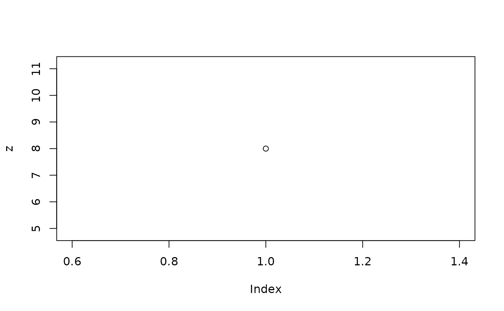

# qenv

## Introduction to `qenv`

A `qenv` inherits from the `environment` class, behaves like an
environment, and has the following characteristics:

- It inherits from the environment and methods such as `$`, `get`, `ls`,
  [`as.list()`](https://rdrr.io/r/base/list.html) work out of the box.
- `qenv` is a locked environment, and data modification is only possible
  through the `eval_code` and `within` functions.
- It stores printed and plotted outputs (see `get_outputs`).
- It stores metadata about the code used to create the data (see
  `get_code`).
- It supports slicing by `[`.
- It is immutable which means that each code evaluation does not modify
  the original `qenv` environment directly.

### Initialization

The
[`qenv()`](https://insightsengineering.github.io/teal.code/reference/qenv.md)
function serves as the gateway to create an initial `qenv` object:

``` r

library(teal.code)

# create a new qenv object
empty_qenv <- qenv()
print(empty_qenv)
```

    ## <environment: 0x55861187af40> 🔒 
    ## Parent: <environment: package:teal.code>

### `qenv` basic usage

To modify the data use `eval_code` to execute R code within the
environment, yielding a new `qenv` object as the output.

``` r

# evaluate code in qenv
my_qenv <- eval_code(empty_qenv, "x <- 2")
print(my_qenv)
```

    ## <environment: 0x55861294ac08> 🔒 
    ## Parent: <environment: package:teal.code> 
    ## Bindings:
    ## - x: [numeric]

``` r

q1 <- eval_code(my_qenv, "y <- x * 2")
q1 <- eval_code(q1, "z <- y * 2")

# my_qenv still contains only x
print(my_qenv)
```

    ## <environment: 0x55861294ac08> 🔒 
    ## Parent: <environment: package:teal.code> 
    ## Bindings:
    ## - x: [numeric]

``` r

names(my_qenv)
```

    ## [1] "x"

``` r

# q1 contains x, y and z
print(q1)
```

    ## <environment: 0x558613746bb0> 🔒 
    ## Parent: <environment: package:teal.code> 
    ## Bindings:
    ## - x: [numeric]
    ## - y: [numeric]
    ## - z: [numeric]

``` r

names(q1)
```

    ## [1] "x" "y" "z"

The same result can be achieved with the `within` method.

``` r

q2 <- within(my_qenv, y <- x * 2)
q2 <- within(q2, z <- y * 2)
q2 <- within(q2, plot(z))
print(q2)
```

    ## <environment: 0x558612b839e0> 🔒 
    ## Parent: <environment: package:teal.code> 
    ## Bindings:
    ## - x: [numeric]
    ## - y: [numeric]
    ## - z: [numeric]

To extract specific object from a `qenv`’s environment, use `[[`. To
extract an output of a `print` or `plot` functions, use
[`get_outputs()`](https://insightsengineering.github.io/teal.code/reference/get_outputs.md)
to get a [`list()`](https://rdrr.io/r/base/list.html) of outputs
captured by `qenv`. These functions are particularly useful for
displaying them in a `shiny` app. You can retrieve the code used to
generate the `qenv` using the
[`get_code()`](https://insightsengineering.github.io/teal.code/reference/get_code.md)
function.

``` r

print(q2[["y"]])
```

    ## [1] 4

``` r

print(get_outputs(q2)[[1]])
```



``` r

cat(get_code(q2))
```

    ## x <- 2
    ## y <- x * 2
    ## z <- y * 2
    ## plot(z)

### Substitutions

In some cases, one may want to substitute some elements of the code
before evaluation. Consider a case when a subset of `iris` is defined by
an input value.

``` r

q <- qenv()
q <- eval_code(q, quote(i <- subset(iris, Species == "setosa")))
q <- eval_code(q, substitute(
  ii <- subset(iris, Species == species),
  env = list(species = "versicolor")
))
input_value <- "virginica"
q <- eval_code(q, substitute(
  iii <- subset(iris, Species == species),
  env = list(species = input_value)
))

summary(q[["i"]]$Species)
```

    ##     setosa versicolor  virginica 
    ##         50          0          0

``` r

summary(q[["ii"]]$Species)
```

    ##     setosa versicolor  virginica 
    ##          0         50          0

``` r

summary(q[["iii"]]$Species)
```

    ##     setosa versicolor  virginica 
    ##          0          0         50

A more convenient way to pass code with substitution is to use the
`within` method.

``` r

qq <- qenv()
qq <- within(qq, i <- subset(iris, Species == "setosa"))
qq <- within(qq, ii <- subset(iris, Species == species), species = "versicolor")
input_value <- "virginica"
qq <- within(qq, iii <- subset(iris, Species == species), species = input_value)

summary(qq[["i"]]$Species)
```

    ##     setosa versicolor  virginica 
    ##         50          0          0

``` r

summary(qq[["ii"]]$Species)
```

    ##     setosa versicolor  virginica 
    ##          0         50          0

``` r

summary(qq[["iii"]]$Species)
```

    ##     setosa versicolor  virginica 
    ##          0          0         50

See
[`?qenv`](https://insightsengineering.github.io/teal.code/reference/qenv.md)
for more details.

### Combining `qenv` objects

Given a pair of `qenv` objects, you may be able to “join” them, creating
a new `qenv` object encompassing the union of both environments, along
with the requisite code for reproduction:

``` r

common_q <- eval_code(qenv(), quote(x <- 1))

x_q <- eval_code(common_q, quote(y <- 5))
y_q <- eval_code(common_q, quote(z <- 5))

join_q <- c(x_q, y_q)

print(join_q)
```

    ## <environment: 0x558612004850> 🔒 
    ## Parent: <environment: package:teal.code> 
    ## Bindings:
    ## - x: [numeric]
    ## - y: [numeric]
    ## - z: [numeric]

``` r

names(join_q)
```

    ## [1] "x" "y" "z"

The feasibility of joining `qenv` objects hinges on the contents of the
environments and the code’s order. Refer to the function documentation
for further details.

### Warnings and messages in `qenv` objects

In cases where warnings or messages arise while evaluating code within a
`qenv` environment, these are captured and stored within the `qenv`
object. Access these messages and warnings using
[`get_messages()`](https://insightsengineering.github.io/teal.code/reference/get_messages.md)
and
[`get_warnings()`](https://insightsengineering.github.io/teal.code/reference/get_warnings.md)
functions as shown below.

``` r

q_message <- eval_code(qenv(), quote(message("this is a message")))
get_messages(q_message)
```

    ## [1] "~~~ Messages ~~~\n\n> this is a message\nwhen running code:\nmessage(\"this is a message\")\n\n~~~ Trace ~~~\n\nmessage(\"this is a message\")"

``` r

q_warning <- eval_code(qenv(), quote(warning("and this is a warning")))
get_warnings(q_warning)
```

    ## [1] "~~~ Warnings ~~~\n\n> and this is a warning\nwhen running code:\nwarning(\"and this is a warning\")\n\n~~~ Trace ~~~\n\nwarning(\"and this is a warning\")"

If any of above returns `NULL`m then no warnings nor messages were
present.

## Utilizing `qenv` inside `shiny` applications

These functions can be seamlessly integrated into `shiny` applications
to produce reproducible outputs. In the example below, the `rcode`
section showcases the code employed for generating the output.

When employing a `qenv` to evaluate code, should an error occur, an
object of type `qenv.error` is generated. This object can be utilized
wherever a `qenv` object is used, alleviating the need for code
alterations to handle these errors. Select the `error_option` in the
example below to witness `qenv` error handling in action.

``` r

library(shiny)
# create an initial qenv with the data in
data_q <- qenv()
data_q <- eval_code(data_q, "iris_data <- iris")

ui <- fluidPage(
  radioButtons(
    "option", "Choose a column to plot:",
    c("Sepal.Length", "Sepal.Width", "Petal.Length", "Petal.Width", "error_option")
  ),
  verbatimTextOutput("rcode"),
  plotOutput("plot")
)

server <- function(input, output, session) {
  # create a qenv containing the reproducible output
  output_q <- reactive({
    req(input$option)
    within(
      data_q,
      p <- hist(iris_data[, .(input$option)])
    )
  })

  # display plot output
  output$plot <- renderPlot(output_q()[["p"]])
  # display code
  output$rcode <- renderText(get_code(output_q()))
}

if (interactive()) {
  shinyApp(ui, server)
}
```

### Reproducibility

The code inside a `qenv` object can be retrieved using `get_code`
function.

``` r

q_reproducible <- qenv()
q_reproducible <- within(q_reproducible, {
  a <- 2
  b <- 5
  c <- a + b
})
cat(get_code(q_reproducible))
```

    ## a <- 2
    ## b <- 5
    ## c <- a + b

``` r

cat(get_code(q_reproducible, names = "a"))
```

    ## a <- 2

``` r

cat(get_code(q_reproducible, names = "c"))
```

    ## a <- 2
    ## b <- 5
    ## c <- a + b

As demonstrated, you can retrieve the code responsible for creating
specific objects by passing the object’s name to the `names` argument in
`get_code`. In scenarios where certain objects are **affected by side
effects** (such as setting options or controlling random number
generation) from previous calls, this dependency can be specified in the
`qenv`. You achieve this by adding the comment `# @linksto` followed by
the name of the linked object.

``` r

q_linked <- qenv()
q_linked <- eval_code(q_reproducible, "
  set.seed(2) # @linksto a
  a <- runif(1)
")
cat(get_code(q_linked))
```

    ## a <- 2
    ## b <- 5
    ## c <- a + b
    ## 
    ##   set.seed(2) # @linksto a
    ##   a <- runif(1)

``` r

cat(get_code(q_linked, names = "a"))
```

    ## a <- 2
    ##   set.seed(2) # @linksto a
    ##   a <- runif(1)

Currently, object linking for reproducibility is only supported by the
`eval_code` function. Since `within` uses an expression as input and
ignores comments, its use is **not recommended** when side-effect
functions are required for full reproducibility.

## `qenv` and `teal` applications

The versatile `qenv` object can seamlessly integrate into teal modules.
Explore the teal vignette [Creating Custom
Modules](https://insightsengineering.github.io/teal/latest-tag/articles/creating-custom-modules.html)
for detailed guidance.
