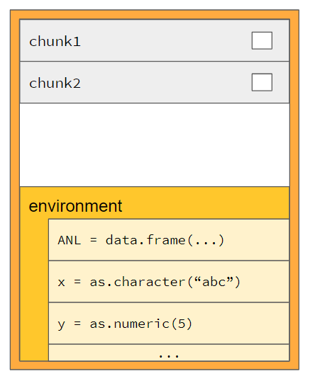
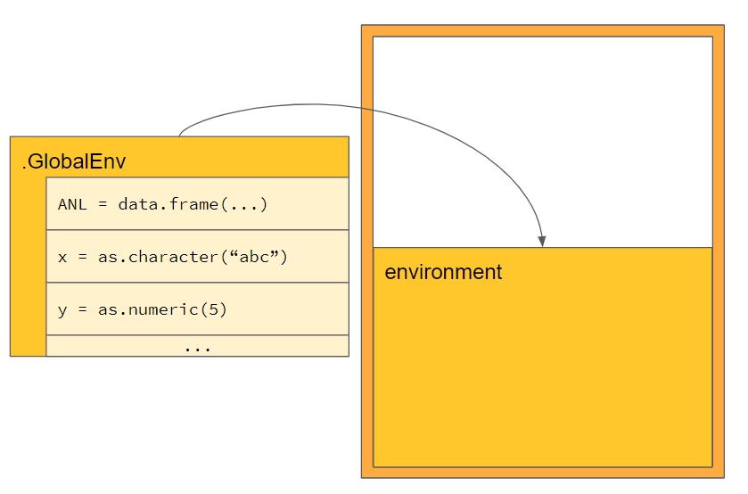
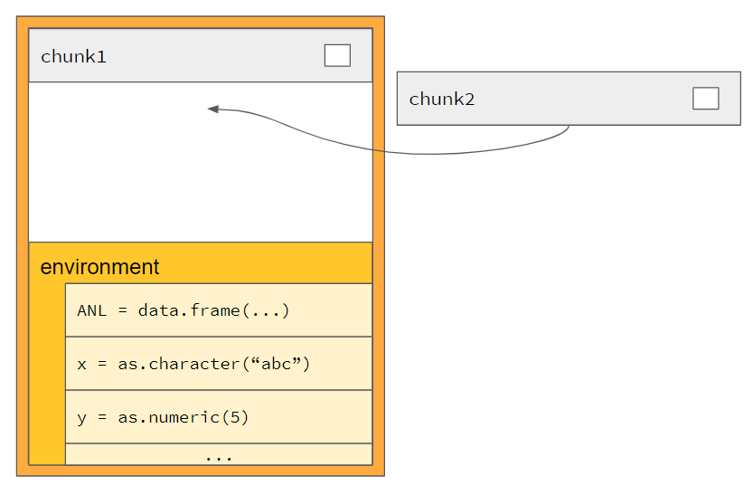
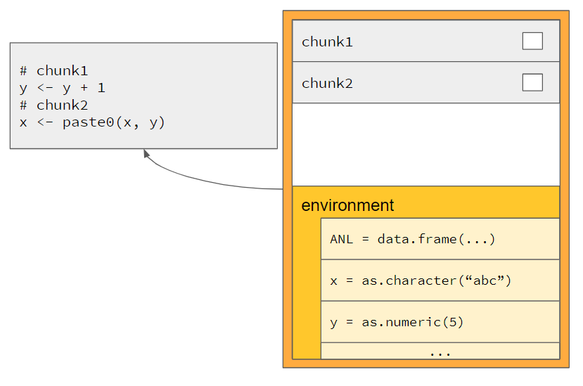
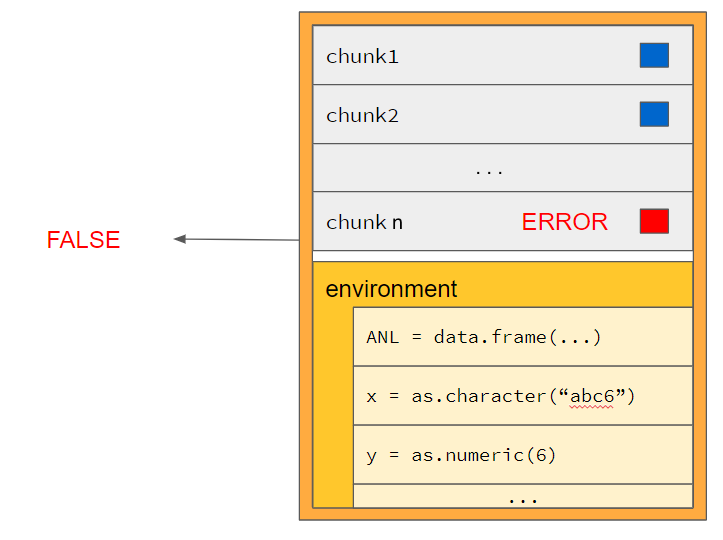
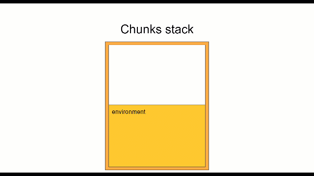

# What is a chunk?
A quoted R expression is a **chunk**. Quoted R expressions can be created in three different ways:
```{r}
a <- 3

# Creating a chunk by quote ------------------------------

expr_a <- quote(sum(a, a))
print(expr_a)
#> sum(a, a)
print(class(expr_a))
#> [1] "call"

# Creating a chunk by bquote ------------------------------

expr_b <- bquote(b <- sum(a, a))
print(expr_b)
#> b <- sum(a, a)
print(class(expr_b))
#> [1] "<-"

# Creating a chunk by call -------------------------------

expr_c <- call("sum", a, a)
print(expr_c)
#> sum(3, 3)
print(class(expr_c))
#> [1] "call"
```

As seen above, a chunk is of class `call` or an assignment given by class `<-`. To evaluate such expressions, R uses the `eval` function. This function evaluates each single `call` inside the current environment, in case no other environment is given. In the example code you can see what happens upon evaluating the chunks:

```{r}
a <- 3
expr_a <- quote(sum(a, a))
expr_b <- bquote(b <- a + a)
expr_c <- call("sum", a, a)

eval(expr_a)
#> 6
eval(expr_b)
#>
print(b)
#> 6
eval(expr_c)
#> 6
```

# The chunks container

The main concept behind the code chunks is the chunks container. This container consists of two elements:

1. A stack of quoted R expressions, each called a "chunk"
2. An environment carrying variable values



As seen in the prior section, each chunk can be evaluated inside the current environment. To evaluate all chunks inside the same environment, the `chunks` R6 object was created in `teal.code`. We refer to this object as "chunks container". It internally has a stack of chunks and the environment where they will get evaluated.

The next sections will tell in a step by step guide which features are provided by the chunks container.

# Step by step to understand chunks

## General information

Normally as a module developer the chunks will be used within the `server` function of a shiny/teal module. This enables storing the chunks container inside the shiny session. For simplicity reasons this feature will be used in the tutorial. To store a container inside the shiny session simply use the call `init_chunks()` and the `chunks` R6 object will be stored in `session$userData$<MODULENAME>$chunks`. After using `init_chunks()`, the functions dealing with chunks can be used. Those are recommended. If for any reasons you want to use your own chunks container, it is possible. Please see the [very last section](https://insightsengineering.github.io/teal.code/articles/basic_chunks.html#implicit-and-explicit-implementation-of-code-chunks) of this article to see the similarities and differences between these two approaches. So for now, just call:

```{r}
# Code needs modification before it can be run:
#   - needs to be placed inside a teal module server function
teal.code::init_chunks()
```

As a simulation of the teal environment the `init_session` function is provided:

```{r}
library(teal)

# pseudo code simulating a shiny session ----------------------------
init_session <- function() {
  session <- new.env()
  session$userData <- new.env() # nolint
  session$ns <- function(x) paste0("x-", x)
  return(session)
}

# initializing code chunks -------------------------------------------
session <<- init_session()
teal.code::init_chunks(session = session)
```

## Feature 1: Reset (initialize the environment)

Normally reproducible code will be used inside a `renderPlot` or `renderTable` call of a shiny module. For simplicity reasons we just use the *pseudo* shiny session in this tutorial. As a first step the chunks container should be handed over an analysis dataset (`ANL`) and two variables `x = "abc"`, `y = 5`. Therefore you need to use the `teal.code::chunks_reset` function. It not only clears off all current chunks inside the container, but also hands over all variables from the current environment to the container environment.

To check that it worked as expected the function `teal.code::chunks_get_var` will be used and check that the values inside the chunks container are equal to the values from the environment.

You can use this code snippet:

```{r}
library(teal)

# pseudo code simulating a shiny session ----------------------------
init_session <- function() {
  sessionint <- new.env()
  sessionint$userData <- new.env() # nolint
  sessionint$ns <- function(x) paste0("x-", x)
  return(sessionint)
}

# initializing code chunks -------------------------------------------
session <<- init_session()
teal.code::init_chunks(session = session)

# Adding variables to the chunks -------------------------------------

ANL <- data.frame(left = c(1, 2, 3), right = c(4, 5, 6)) # nolint
x <- "abc"
y <- 5

teal.code::chunks_reset()

# Double check variables were handed over-----------------------------
all.equal(x, teal.code::chunks_get_var("x"))
```




## Feature 2: Push - adding code snippets

To populate chunks, a chunk can be added using the `teal.code::chunks_push` function. Here two code snippets will be added:

```{r}
# Code needs modification before it can be run:
#    - chunks need to exist inside the environment
chunks_push(bquote(y <- y + 1))
chunks_push(bquote(x <- paste0(x, y)))
```



## Feature 3: Get R code - showing the chunks code

To reproduce what was done inside the chunks, it is necessary to render the R code inside them. Therefore the chunks container can display all its code by calling `teal.code::chunks_get_rcode`. You can run this example to see the code:

```{r}
# Code needs modification before it can be run:
#   - chunks need to exist inside the environment
#   - chunks needed to be pushed to the container
chunks_get_rcode()

#>            chunk_1               chunk_2
#>       "y <- y + 1"   "x <- paste0(x, y)"
```


## Feature 4: eval - evaluating the code

The `eval` function is responsible to run the code inside the chunks container. The eval function of a chunks container is called `teal.code::chunks_eval`. It evaluates all chunks inside the container in the order they were pushed. It is not possible to change the order or run just pieces of the code. The chunks will always be evaluated without any error, even if an error appears. You will learn more about errors in following parts.

The `teal.code::chunks_eval` will always return the value of the last evaluation. By `teal.code::chunks_get_var` it is possible to retrieve specific variables after evaluation.

```{r}
# Code needs modification before it can be run:
#   - chunks need to exist inside the environment
#   - chunks needed to be pushed to the container
chunks_eval()
#> "abc6"
chunks_get_var("x")
#> "abc6"
chunks_get_var("y")
#> 6
```


## Feature 5: Is ok - check for errors and warnings

As already said the chunks will never throw an error upon execution. Errors are caught and stored in error messages. The most important function to check if everything went fine is `teal.code::chunks_is_ok`. It will return `TRUE` in case everything was fine.

`teal.code::chunks_validate_is_ok` returns a useful `validate(need(...))` message inside the shiny app in case something went wrong.

Additionally, the function `teal.code::chunks_safe_eval` can be used inside shiny, which will evaluate the chunks container and check if everything went right.

```{r}
# Code needs modification before it can be run:
#   - chunks need to exist inside the environment
#   - chunks needed to be pushed to the container
chunks_is_ok()
#> TRUE
chunks_validate_is_ok()
#>

# Trying an error inside a chunk ------------------------
chunks_push(quote(stop("ERROR")))
chunks_eval()

chunks_is_ok()
#> FALSE

chunks_validate_is_ok()
#> Error: The following errors(s) occurred:
#> ERROR
#>
#> when evaluating the following code:
#> stop("ERROR")
```



## Tutorial Summary

In summary:

1. chunks host code snippets
2. chunks host their own environment
3. chunks are initialized inside shiny using `teal.code::init_chunks`
4. chunks can be accessed to retrieve variables from the environment using `teal.code::chunks_get_var`
5. chunks can be added to the chunks container by `teal.code::chunks_push`
6. All chunks inside a container can be executed by `teal.code::chunks_eval`
7. `teal.code::chunks_safe_eval`, `teal.code::chunks_validate_is_ok` and `teal.code::chunks_is_ok` allow checking for execution errors

The whole implementation of this tutorial is given in the *gif* below:




For more information about the implementation of chunks inside of shiny/teal module, please visit the Advanced chunks article.

Please find below the implicit vs. explicit usage of code chunks.

---

## Implicit and Explicit implementation of code chunks

There are two ways to use the code chunks inside shiny modules. First you can generate
a chunk stack using R6. As we noticed that chunk stacks have to be reactive, we
coupled the R6 stack in a reactive way to the shiny session and provided module
developers with an implicit implementation. The implicit implementation lets you
ignore the location of the chunk stack. Moreover you have wrappers around many
of the explicit functions.

Please see the following example of how to derive the same chunk stack in an implicit and explicit way:


| Explicit - using R6                                  | Implicit - use teal.code functions         |
|------------------------------------------------------|---------------------------------------------|
| session_chunks <- chunks\$new()                       | teal.code::init_chunks()                   |
|                                                      |                                             |
| a <- 1                                               | a <- 1                                      |
| b <- 2                                               | b <- 2                                      |
|                                                      |                                             |
| session_chunks\$reset() # sets a & b in env           | teal.code::chunks_reset()                              |
|                                                      |                                             |
| # sets a & b in env, use all variables from datasets | # sets a & b in env, use all variables from datasets |
| session_chunks\$reset(datasets = datasets)           | teal.code::chunks_reset(datasets = datasets)           |
|                                                      |                                             |
| session_chunks\$push(x = bquote(a <- a + 1))          | teal.code::chunks_push(expression = bquote(a <- a + 1))|
|                                                      |                                             |
| session_chunks\$pop() *# remove last chunk*           | *#not possible*                             |
|                                                      |                                             |
| session_chunks\$eval()                                | teal.code::chunks_eval()                               |
| stopifnot(session_chunks\$get("a") == 2)              | stopifnot(chunks_get_var("a") == 2)         |
|                                                      |                                             |
| session_chunks\$push(x = bquote(c <- a + b))          | teal.code::chunks_push(expression = bquote(c <- a + b))|
| session_chunks\$eval()                                | teal.code::chunks_eval()                               |
|                                                      |                                             |
| stopifnot(session_chunks\$get("c") == 4)              | stopifnot(chunks_get_var("c") == 4)         |
|                                                      |                                             |
| session_chunks\$push(x = quote(a + b + c))            | teal.code::chunks_push(expression = quote(a + b + c))  |
| stopifnot(session_chunks\$eval() == 8)                | stopifnot(chunks_eval() == 8)               |
| *# eval gives return value*                          |                                             |
| session_chunks\$get("a")                              | chunks_get_var("a")                         |
|                                                      |                                             |
| # merging two chunks objects                         |                                             |
| session_chunks2 <- chunks\$new()                      | session_chunks2 <- chunks\$new()             |
| session_chunks2\$push(bquote(d <- 1))                 | session_chunks2\$push(bquote(d <- 1))        |
| session_chunks\$push_chunks(session_chunks2)          | chunks_push_chunks(session_chunks2)         |
| session_chunks\$eval()                                | teal.code::chunks_eval()                               |
| session_chunks\$get("d")                              | chunks_get_var("d")                         |
