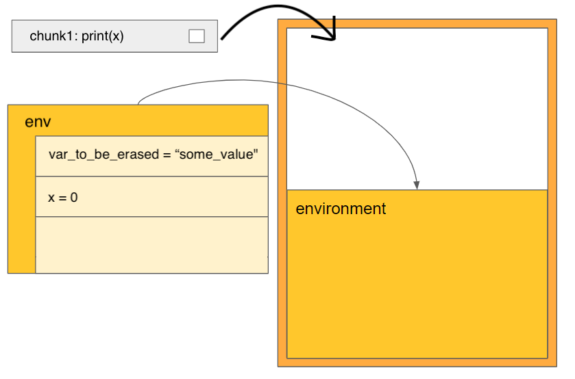

# The chunks container

The main concept behind code reproducibility in teal is the chunks container object. This object consists of two elements:

1. A stack of quoted R expressions, each called a "chunk"
2. An environment carrying variables and their values


The chunks container object allows the evaluation of all expressions it contains in its own isolated environment, thus having no side effects on the surrounding environment.

The next sections will explain what a chunk is and how it is evaluated.

# What is a chunk?

A quoted R expression is a necessary step to create a **chunk** object, which is an R6 object of class `chunk_call`. Quoted R expressions can be created in many different ways, four of which will be described:
```{r}
a <- 3

# Creating a chunk by quote ------------------------------
expr_a <- quote(sum(a, a))
print(expr_a)

# Creating a chunk by substitute ------------------------------
expr_b <- substitute(b <- sum(a, a))
print(expr_b)

# Creating a chunk by call -------------------------------
expr_c <- call("sum", a, a)
print(expr_c)

# Creating a chunk by rlang::expr -------------------------------
expr_d <- rlang::expr(sum(a, a))
print(expr_d)
```

To evaluate the expressions of class `call` or an assignment given by class `<-` above, R uses the `eval` function. This function evaluates each single `call` inside the current environment by default, but it does contain a parameter to input a specific environment argument to execute the expression in.

```{r}
a <- 3
expr_a <- quote(sum(a, a))
expr_b <- substitute(b <- a + a)

eval(expr_a)
eval(expr_b)
print(b)
```

`chunk` objects can be created and evaluated using the expressions above as follows:

```{r}
chunk_1 <- teal.code::chunk$new(expression = expr_a)
chunk_1$eval()

chunk_2 <- teal.code::chunk$new(expression = expr_b)
chunk_2$eval()
print(b)
```

Note that `teal.code::chunk` is merely an alias for `teal.code::chunk_call`. And so the following code is the same as the above code:

```{r}
chunk_1 <- teal.code::chunk_call$new(expression = expr_a)
chunk_1$eval()

chunk_2 <- teal.code::chunk_call$new(expression = expr_b)
chunk_2$eval()
print(b)
```

## Motivation for the chunk (chunk_call) object

A quoted R expression can simply be evaluated with the base function, `eval`, as demonstrated above. But additional functionalities are needed for the `chunks` container to work. Here are some additional methods, besides `eval`, that the `chunk` object contains:

```{r}
# answers the question of whether the code executed without error
chunk_1$is_ok()

# answers the question of whether the code has been executed
chunk_1$is_evaluated()

# returns error messages, if any, in the form of a string
chunk_err <- teal.code::chunk_call$new(expression = quote(stop("error in chunk")))
chunk_err$get_errors() # no error before evaluation
chunk_err$eval()
chunk_err$get_errors()
```

Internally, the `chunks` container will convert quoted base R expressions into `chunk` objects as they are pushed in.

## Creation of a chunks container object

A chunks container may be initialized as an empty container.

```{r}
# initializing code chunks -------------------------------------------
chunks_container_empty <- teal.code::chunks$new()
```

However, it can also be initialized with a specific environment.

```{r}
# initializing code chunks -------------------------------------------
env <- new.env()
env$var_to_be_erased <- "some_value"
env$x <- 0
chunks_container <- teal.code::chunks$new(envir = env)

# method to list all variables in the chunks environment
chunks_container$ls()

# function to add a chunk to a chunks container object
teal.code::chunks_push(quote(print(x)), chunks = chunks_container)

# function to get all expressions from a chunks container code stack
teal.code::chunks_get_rcode(chunks_container)
```



At any point, a chunks container can be reset. Resetting means that all expressions in its code stack will be emptied and its environment will be overridden by the inputted environment, which defaults to the parent environment.

```{r}
env <- new.env()
env$anl <- data.frame(left = c(1, 2, 3), right = c(4, 5, 6))
env$x <- "abc"
env$y <- 5

teal.code::chunks_reset(envir = env, chunks = chunks_container)

# note that the variable var_to_be_erased is removed
chunks_container$ls()

# this function is used to extract values of variables in a chunks container environment
# note that the variable x is overriden
teal.code::chunks_get_var("x", chunks = chunks_container)

# note that the code stack has been emptied
teal.code::chunks_get_rcode(chunks_container)
```


As mentioned above, the `teal.code::chunks_push` function is used to push expressions into the chunks container.

```{r}
teal.code::chunks_push(substitute(y <- y + 1), chunks = chunks_container)
teal.code::chunks_push(substitute(x <- paste0(x, y)), chunks = chunks_container)
```


As mentioned above, the `teal.code::chunks_get_rcode` function is used to get all expressions pushed into the chunks container.

```{r}
teal.code::chunks_get_rcode(chunks_container)
```


## Executing the code stored in the stack

The chunks container also has an `eval` method which runs all code inside the chunks container. This method is wrapped inside the function `teal.code::chunks_safe_eval`. It evaluates all chunks inside the container in the order they were pushed and returns the value of the last evaluated expression. It is not possible to change the order or run just some of the expressions.

```{r}
teal.code::chunks_safe_eval(chunks_container)
teal.code::chunks_get_var("x", chunks = chunks_container)
teal.code::chunks_get_var("y", chunks = chunks_container)
```


It is still possible to push more code expressions into a chunks container that has already been evaluated. These newly added expressions may also modify the environment.

```{r}
teal.code::chunks_push(quote(z <- 10), chunks = chunks_container)
teal.code::chunks_get_rcode(chunks_container)

teal.code::chunks_safe_eval(chunks_container)
chunks_container$ls()
teal.code::chunks_get_var("z", chunks = chunks_container)
```

Note that code that have already been evaluated will not be re-evaluated when newly added code is evaluated.

```{r}
teal.code::chunks_push(quote(print("I will only be evaluated once")), chunks = chunks_container)
teal.code::chunks_safe_eval(chunks_container)

teal.code::chunks_push(quote(rm(z)), chunks = chunks_container)

# note that the string "I will only be evaluated once" is not printed again
teal.code::chunks_safe_eval(chunks_container)

# z is removed
chunks_container$ls()
```

## Handling errors (and warnings)

The function `teal.code::chunks_safe_eval` is named `"safe_eval"` because it performs an additional step to handle errors by calling another method of the chunks container object, `validate_is_ok`. If any error occurs during the evaluation of expressions pushed into the chunks container, the error is handled and stored in the `chunk` object that contains the expression, and thus no error is thrown to the calling environment.

The function `teal.code::chunks_is_ok` will return `TRUE` if all evaluated expressions in the chunks container evaluated without throwing an error.

`teal.code::chunks_validate_is_ok` returns a useful `validate(need(...))` which a shiny app will use to display an error message in the UI instead of crashing the app.

```{r, error=TRUE}
teal.code::chunks_is_ok(chunks_container)
teal.code::chunks_validate_is_ok(chunks = chunks_container)

# Trying an error inside a chunk ------------------------
teal.code::chunks_push(quote(stop("ERROR")), chunks = chunks_container)
teal.code::chunks_safe_eval(chunks_container)

teal.code::chunks_is_ok(chunks_container)

# internally, teal.code::chunks_safe_eval calls teal.code::chunks_validate_is_ok before returning
teal.code::chunks_validate_is_ok(chunks = chunks_container)
```


The use of the `teal.code::chunks_safe_eval` is good practice in a reactive context. Since errors are not thrown to the environment calling the chunks container, it will not crash the shiny app, which is a good thing. However, the shiny app will also not know that an error has occurred. Calling `teal.code::chunks_safe_eval` instead of the `eval` method of the chunks container ensures that a validation step occurs.

## Tutorial Summary

In summary:

1. chunks containers host code snippets
2. chunks containers host their own environment
3. chunks container can be accessed to retrieve variables from the environment using `teal.code::chunks_get_var`
4. expressions can be added to the chunks container by `teal.code::chunks_push`
5. code inside a container is executed by its `eval` method.
6. `teal.code::chunks_is_ok` allows checking for execution errors
7. `teal.code::chunks_validate_is_ok` allows a shiny app to display a validate message of the errors in the ui
8. `teal.code::chunks_safe_eval` will evaluate all snippets of the chunks container and then call `validate(need(...))` to let a shiny app silently handle any errors that occurred so that error messages can be outputted in the UI.

For more information about the implementation of chunks inside of shiny/teal module, please go on to the Advanced chunks article.
