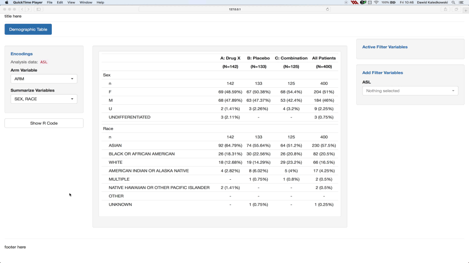

Reproducibility is an important feature when it comes to data analysis for the following reasons:

- Ability of users to reproduce the outputs at any moment in a simple R console outside of a reactive shiny app.
- Provides transparency where it helps users and others understand what happened during the analysis.

This is where the `chunks` concept of `teal.code` package comes into play to provide methods to develop reproducible shiny/teal modules. The `teal` package complements the chunks concept by providing a server and an interface to retrieve the reproducible code via `Show R code` button.

Note that there is a public [`shinymeta`](https://github.com/rstudio/shinymeta) R package from `RStudio` that offers similar functionality. However, currently, `shinymeta` can not be easily integrated into `teal` modules and hence we recommend using `chunks` for `teal` based apps.

# Reproducibility in teal

Well-designed teal applications should be set up such that for every output displayed, the associated R code can be requested via the **Show R code button**. In order to develop a teal application with reproducible outputs the app developer needs to take this into account when implementing the app.

The reproducible code displayed for outputs in `teal` is always made from three parts:

1. Header which includes information such as:
  - directory path
  - server name
  - R version
  - date
  - `libPaths()`
  - packages' versions.

2. Preprocessing Code: refers to the code which precedes the teal app initialization, this includes:
  - Data imports
  - Data transformation
  - Checking data reproducibility

3. Teal Module Analysis Code which includes:
  - [Data merging](https://insightsengineering.github.io/teal.transform/articles/transforming-teal-data)
  - Filtering and encodings
  - Data analysis/visualization

The header is created by `teal`, the preprocessing code must be supplied by the app developer and the analysis code is provided by the teal modules.

# Chunks

The code chunks were introduced to allow the development of reproducible `shiny`/`teal`modules. A reproducible module includes a "Show R Code" button which can display the code needed to reproduce the outputs of the module. Inside the modal, which pops up after clicking the button, you should see:

1. The code loading the necessary libraries - by `teal::get_code`
2. The code used for loading and filtering data sets  - by `teal::FilteredData`
3. The code used for merging multiple data sets - by `teal.transform::data_merge_srv`
4. The code generating the outputs - by **code chunks**

The code chunks were especially designed for the code leading from an input data set to the outputs. To get more information about the concept of chunks, please refer to article [`basic chunks`](https://insightsengineering.github.io/teal.code/articles/basic_chunks.html).
